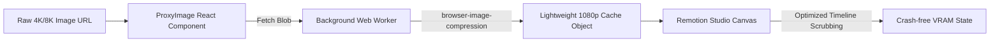

# Remotion VRAM Optimizer ⚡

A high-efficiency, client-side image proxying and sequential rendering optimizer for [Remotion](https://www.remotion.dev/). This project provides a robust, production-grade pattern to handle ultra-high resolution (4K+) assets in video composition environments without triggering browser Out-of-Memory (OOM) or system VRAM crashes.

## 🔴 The Problem

In rich dynamic video editors, loading multiple heavy 4K/8K images (e.g., 7360x4912) simultaneously inside React `` tags causes massive browser decoded image cache explosions. In Remotion Studio or headless Puppeteer render nodes, this leads to immediate Chrome tab crashes or headless execution crashes due to hardware-accelerated memory exhaustion.

## 🟢 The Solution: WebWorker Image Proxying

This repository demonstrates an elegant **Client-Side Proxy Pattern**:
1. **Asynchronous Interception:** Heavy image assets are directed through a custom React `<ProxyImage />` component instead of native tags.
2. **Background Compression:** The component fetches raw blobs and utilizes `browser-image-compression` running inside a background Web Worker.
3. **Optimized Display Cache:** It outputs a lightweight, resized (1080p) proxy into the active Remotion composition container, ensuring smooth, crash-free timeline scrubbing.
4. **Single-Concurrency Export:** Configures Remotion render configurations to execute with strict sequential limits, guaranteeing memory consumption remains completely flat during compilation.

## 🛠️ Architecture



## 📦 Tech Stack

- **Core Engine:** Remotion Studio & Remotion CLI
- **Compression Worker:** `browser-image-compression` (Web Worker)
- **Framework:** React 18, TypeScript, Tailwind CSS, Zod (validation schemas)

## ⚙️ Setup & Installation

```bash
# Clone and enter directory
git clone https://github.com/KhoaTheBest/remotion-vram-optimizer.git
cd remotion-vram-optimizer

# Install dependencies
npm install

# Run the Remotion Studio preview playground
npm run dev

# Render the composition to MP4 (with sequential limits)
npm run build
```

## 💡 Engineering Highlights & Optimizations

- **Web Worker Offloading:** Offloaded intensive image resizing processes to multi-threaded worker files, keeping the main UI thread running at a smooth 60 FPS.
- **Resource Recovery:** Automatically clears local Object URLs on unmount to prevent memory leaks from bloating the browser's Garbage Collector.
